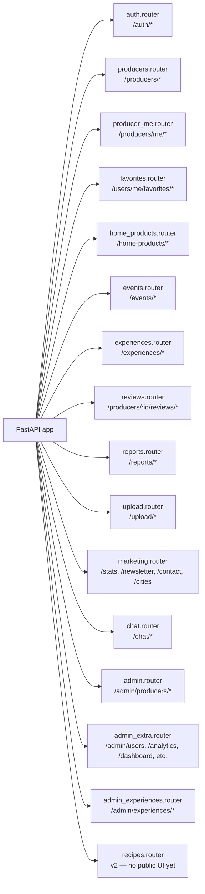

# מהמקור — API routes

> Mermaid maps of all FastAPI routes, grouped by feature area. **Source
> of truth is `backend/app/routers/*.py`** (registered in
> `backend/app/main.py::include_router` calls). If routes drift,
> update this diagram in the same PR (workflow rule 11).
>
> Legend for auth columns:
>   - 🌐 = public (no token)
>   - 🔑 = any authenticated user (`get_current_user`)
>   - 👤 = producer role (`require_producer`)
>   - 🛡️ = admin role (`require_admin`)

## 1. Registered routers at a glance



## 2. Public discovery (what the homepage/map/producer pages hit)

```mermaid
graph TD
    Home[Homepage + Map + Category pills] --> GProducers[GET /producers<br/>🌐 query: lat/lng/radius_km<br/>category, delivery_city, q, verified]
    GProducers --> LProducers[Haversine distance,<br/>status=approved only]

    Home --> GCategories[GET /categories<br/>🌐 list all]
    Home --> GStats[GET /stats<br/>🌐 producers_count, categories_count]
    Home --> GCities[GET /cities<br/>🌐 deduped sorted list]

    ProducerClick[Click producer card] --> GProducer[GET /producers/{id}<br/>🌐 + ?from=search/map/home<br/>logs producer_page_views best-effort]
    ProducerClick --> GSlug[GET /producers/by-slug/{slug}<br/>🌐 same but by slug]
    GProducer --> WhatsApp[POST /producers/{id}/whatsapp-click<br/>🌐 rate-limited 10/min<br/>logs producer_whatsapp_clicks]

    GProducer --> GReviews[GET /producers/{id}/reviews<br/>🌐 paginated]
    GProducer --> Reports_post[POST /producers/{id}/report<br/>🔑 rate-limited]
```

## 3. Auth + account self-service

```mermaid
graph TD
    SignUp[/register page] --> RegConsumer[POST /auth/register<br/>🌐 rate-limited 3/hour]
    SignUp --> RegProducer[POST /auth/register/producer<br/>🌐 multi-step form<br/>creates Producer+User in one tx]
    SignUp --> OAuthG[POST /auth/google<br/>🌐 id_token]
    SignUp --> OAuthA[POST /auth/apple<br/>🌐 identity_token<br/>App Store requirement]

    Login[/login page] --> LoginPost[POST /auth/login<br/>🌐 rate-limited 5/min]

    Account[/settings page] --> Me[GET /auth/me<br/>🔑 current user]
    Account --> Delete[DELETE /users/me<br/>🔑 cascade delete<br/>App Store requirement]

    Favorites[/favorites page] --> ListFavs[GET /users/me/favorites<br/>🔑]
    Favorites --> AddFav[POST /users/me/favorites/{id}<br/>🔑]
    Favorites --> DelFav[DELETE /users/me/favorites/{id}<br/>🔑]

    Account --> Follow[POST /producers/{id}/follow<br/>🔑 notification prefs]
    Account --> Unfollow[DELETE /producers/{id}/follow<br/>🔑]
    Account --> Following[GET /users/me/following<br/>🔑]
```

## 4. Producer self-management (role=producer)

```mermaid
graph TD
    Dashboard[/producer/dashboard page] --> Me_p[GET /producers/me<br/>👤 own producer record]
    Dashboard --> DashData[GET /producers/me/dashboard<br/>👤 favorites_count + whatsapp_clicks_week]
    Dashboard --> Analytics[GET /producers/me/analytics<br/>👤 feature/producer-analytics<br/>windowed views+searches+whatsapp,<br/>follower delta, avg rating,<br/>home_products, 30d chart, top cities]
    Dashboard --> Avail[POST /producers/me/availability<br/>👤 toggle is_available_today]
    Dashboard --> Update[PUT /producers/me<br/>👤 edit own profile]
    Dashboard --> UploadImg[POST /upload/image<br/>🔑 Cloudinary, magic-byte validated]

    NeighborList[/neighbor + create home product] --> HPCreate[POST /home-products<br/>🔑 Claude Opus moderation on write]
    NeighborList --> HPList[GET /home-products<br/>🌐 city/category filter]
    NeighborList --> HPDelete[DELETE /home-products/{id}<br/>🔑 owner-only w/ admin override]
    NeighborList --> HPClick[POST /home-products/{id}/whatsapp-click<br/>🔑 schedules Twilio follow-up]
    NeighborList --> HPRate[POST /home-products/rate/{token}<br/>🌐 token-based single-use]

    Events[/events + /experiences] --> EventCreate[POST /events<br/>👤]
    Events --> ExpCreate[POST /experiences<br/>🔑 Claude Haiku pre-check +<br/>admin approval queue]
```

## 5. Admin surface (role=admin)

```mermaid
graph TD
    Dashboard[/admin dashboard page] --> AdminDash[GET /admin/dashboard<br/>🛡️ stats + monthly_producers chart +<br/>daily_active_users + top_cities +<br/>server_health + pending_moderation_count]

    Producers[/admin/producers page] --> AdminPList[GET /admin/producers/pending<br/>🛡️]
    Producers --> Approve[POST /admin/producers/{id}/approve<br/>🛡️]
    Producers --> Reject[POST /admin/producers/{id}/reject<br/>🛡️]
    Producers --> Toggle[POST /admin/producers/{id}/toggle-status<br/>🛡️]
    Producers --> Import[POST /admin/producers/import<br/>🛡️ Excel dry-run + commit]
    Producers --> AdminEdit[PATCH /admin/producers/{id}<br/>🛡️ any field]

    Users[/admin/users page] --> AdminUsers[GET /admin/users<br/>🛡️ search + role filter]
    Users --> Role[PUT /admin/users/{id}/role<br/>🛡️]
    Users --> Block[POST /admin/users/{id}/block<br/>🛡️]

    Content[/admin/content page] --> AdminCats[GET/POST/PUT/DELETE /admin/categories<br/>🛡️ CRUD]
    Content --> AdminPages[GET/PUT /admin/pages/{slug}<br/>🛡️ about/terms editor]

    Reports[/admin/reports page] --> AdminReports[GET /admin/reports<br/>🛡️ sorted by urgency]
    Reports --> Resolve[POST /admin/reports/{id}/resolve<br/>🛡️]

    Analytics[/admin/analytics page] --> AdminAnalytics[GET /admin/analytics<br/>🛡️ charts + heatmap + top producers]

    ExperiencesAdmin[/admin/experiences page] --> AdminExpList[GET /admin/experiences?status=<br/>🛡️ 5-tab queue]
    ExperiencesAdmin --> ExpApprove[POST /admin/experiences/{id}/approve<br/>🛡️]
    ExperiencesAdmin --> ExpReject[POST /admin/experiences/{id}/reject<br/>🛡️ host notification email]
    ExperiencesAdmin --> ExpChanges[POST /admin/experiences/{id}/request-changes<br/>🛡️ host notification email]

    Settings[/admin/settings page] --> AdminSettings[GET/PUT /admin/settings<br/>🛡️ admin emails, WhatsApp,<br/>Twilio/Cloudinary health checks]
```

## 6. Marketing + misc (anonymous, rate-limited)

```mermaid
graph LR
    Footer[Footer newsletter form] --> Newsletter[POST /newsletter<br/>🌐 5/hour per IP<br/>idempotent — returns 201 whether<br/>already subscribed or not]

    ContactForm[/contact page form] --> Contact[POST /contact<br/>🌐 5/hour per IP<br/>persists to contact_messages +<br/>SMTP email to CONTACT_EMAIL,<br/>fail-open on SMTP errors]

    Chat[ChatWidget.jsx floating button] --> ChatQA[POST /chat/qa<br/>🌐 Anthropic Haiku<br/>fail-open if ANTHROPIC_API_KEY unset]
```
