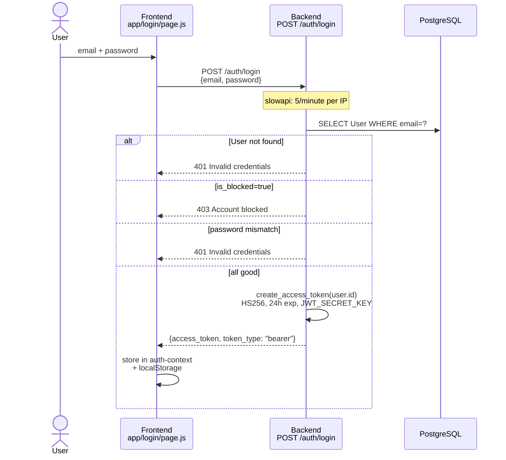
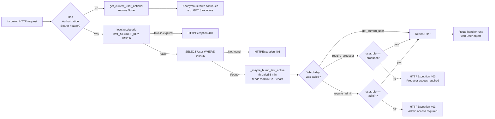
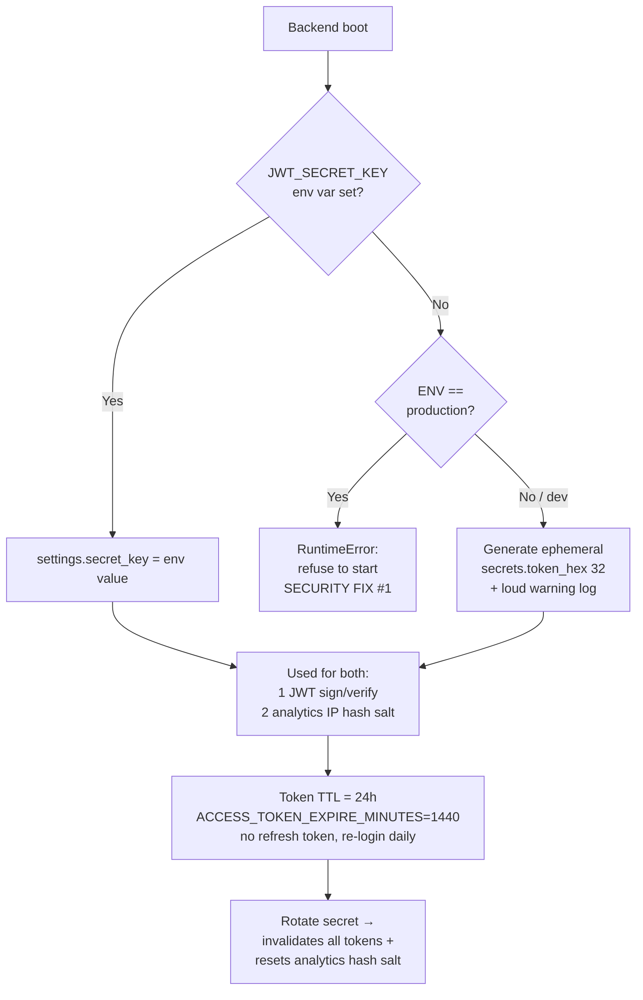

# מהמקור — Auth flow

> Mermaid diagrams for the auth surface: consumer/producer registration,
> login, Google OAuth, Apple OAuth, JWT lifecycle, and role-gated
> dependencies. Designed to be loaded into every Claude Code session via
> `--append-system-prompt "$(cat .ai/diagrams/*.md)"` so I start with
> architecture context without needing to re-read files.
>
> **Ground truth:** `backend/app/routers/auth.py` + `backend/app/auth.py`
> (see `docs/DATA.md` endpoints table). If the diagrams drift from the
> code, the code wins — update the diagram.

## 1. Registration — three paths, three endpoints

```mermaid
flowchart TD
    Start([New user lands on /register]) --> Choice{Consumer or<br/>business owner?}

    Choice -->|Consumer — default| ConsumerForm[/register page.js]
    ConsumerForm --> CP[POST /auth/register]
    CP --> CreateConsumer[Create User<br/>role=consumer]
    CreateConsumer --> IssueJWTc[create_access_token user.id]
    IssueJWTc --> ReturnTokenC[Return Token<br/>access_token 24h]

    Choice -->|Business owner — multi-step| ProducerForm[/register/producer page.js<br/>4 steps: account → business → delivery → consents]
    ProducerForm --> PP[POST /auth/register/producer]
    PP --> TxBegin[DB transaction]
    TxBegin --> CreateProducer[Create Producer<br/>status=pending]
    CreateProducer --> CreateUser[Create User<br/>role=producer<br/>producer_id=new producer.id]
    CreateUser --> LinkCats[Link producer_categories + delivery_areas]
    LinkCats --> TxEnd[Commit tx]
    TxEnd --> NotifyAdmin[Optional: Twilio WhatsApp + SMTP<br/>admin notification<br/>fail-open on missing config]
    NotifyAdmin --> IssueJWTp[create_access_token user.id]
    IssueJWTp --> ReturnTokenP[Return Token<br/>access_token 24h]

    Choice -->|OAuth one-click| OAuthChoice{Google or Apple?}
    OAuthChoice -->|Google| GoogleFlow[POST /auth/google<br/>body: id_token]
    OAuthChoice -->|Apple| AppleFlow[POST /auth/apple<br/>body: identity_token<br/>required for App Store]
    GoogleFlow --> VerifyG[google-auth:<br/>verify id_token against<br/>GOOGLE_CLIENT_ID]
    AppleFlow --> VerifyA[PyJWT:<br/>verify identity_token against<br/>Apple public keys + APPLE_CLIENT_ID]
    VerifyG --> UpsertG[Upsert User by google_id<br/>role=consumer]
    VerifyA --> UpsertA[Upsert User by apple_id<br/>role=consumer]
    UpsertG --> IssueJWTo[create_access_token user.id]
    UpsertA --> IssueJWTo
    IssueJWTo --> ReturnTokenO[Return Token<br/>access_token 24h]

    ReturnTokenC --> Client[Frontend stores JWT<br/>in auth-context]
    ReturnTokenP --> Client
    ReturnTokenO --> Client
```

## 2. Login — single endpoint, rate-limited



## 3. JWT verification + role gates on every authenticated request



## 4. JWT lifecycle + secret loading (CLAUDE.md locked decision)


