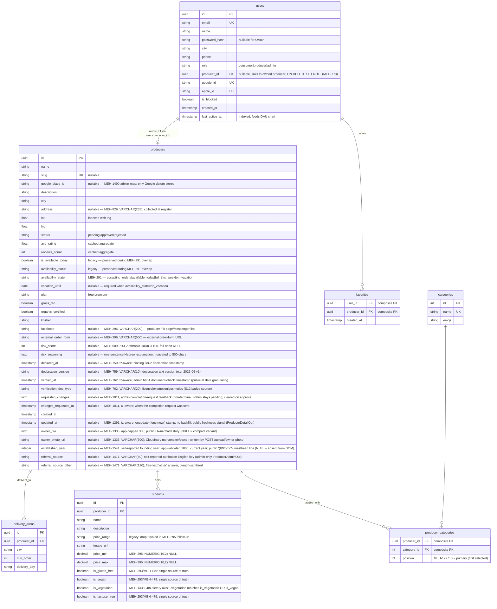
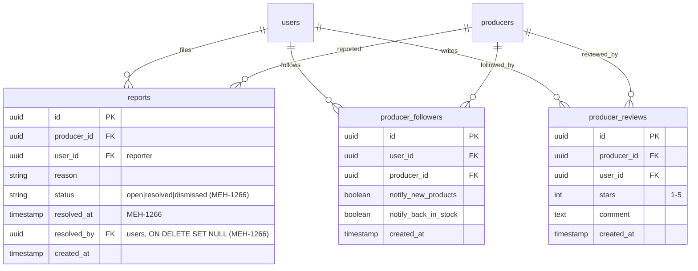
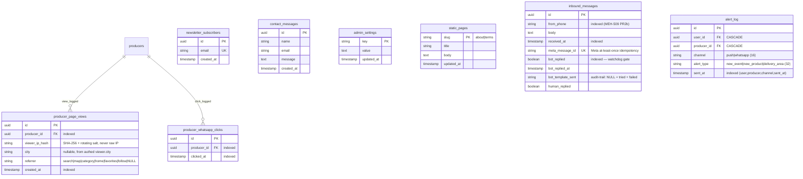

# מהמקור — DB schema

> Mermaid ER diagram for the main tables + relationships. **Source of
> truth is `backend/app/models/models.py`** — if this drifts, update
> the diagram in the same PR (workflow rule 11).
>
> Grouped into four logical clusters to keep the diagram legible:
>   1. Core directory (producers, categories, delivery, users)
>   2. Community content (home products, experiences, events)
>   3. Trust & safety (reviews, reports, moderation, favorites, followers)
>   4. Analytics (views, WhatsApp clicks, DAU) + marketing (newsletter, contact)

## 1. Core directory



## 2. Community content — home products, events, experiences

```mermaid
erDiagram
    users ||--o{ home_products : "lists"
    users ||--o{ events : "hosts (producer)"
    users ||--o{ experiences : "hosts (producer)"
    home_products ||--o{ home_product_whatsapp_clicks : "gets clicks"
    home_product_whatsapp_clicks ||--o| home_product_ratings : "optional 1:1"

    home_products {
        uuid id PK
        uuid user_id FK
        string title
        text description
        string phone
        string city
        string neighborhood
        int quantity
        numeric price
        string category
        string moderation_status "APPROVED|FLAGGED|REJECTED"
        text moderation_reason "Claude Opus output"
        text moderation_suggestion
        boolean is_active
        boolean is_hidden
        date available_until
        timestamp created_at
    }

    home_product_whatsapp_clicks {
        uuid id PK
        uuid user_id FK "viewer"
        uuid home_product_id FK
        timestamp clicked_at
        boolean rating_sent "Twilio follow-up 24h"
        boolean rated
        string rating_token UK
    }

    home_product_ratings {
        uuid id PK
        uuid click_id FK UK "one rating per click"
        uuid user_id FK
        int stars "1-5"
        string comment "max 100 chars"
    }

    events {
        uuid id PK
        uuid producer_id FK
        string title
        text description
        date event_date
        time event_time
        numeric price
        int capacity
        string city
        string status "pending|approved|rejected"
    }

    experiences {
        uuid id PK
        uuid user_id FK "host"
        string title
        text description
        string city
        timestamp starts_at
        int duration_minutes
        numeric price
        int capacity
        string status "pending|changes_requested|approved|rejected"
        boolean is_active "MEH-1419: reversible host cancel; public list filters true"
        text moderation_notes "Claude Haiku pre-check output"
        timestamp created_at
    }
```

## 3. Trust & safety — reviews, reports, followers



> **MEH-773 integrity constraints (migration `382128b23383` + Chunk B ORM):**
> `reports` has `UNIQUE(reporter_id, producer_id)` (`uq_report_reporter_producer`)
> and `referral_clicks` has `UNIQUE(referee_id)` (`uq_referral_one_per_referee`)
> — one report per (reporter, producer), one referral credit per referee.
> `users.producer_id` is `ON DELETE SET NULL`. `phone_otp_tokens` and
> `kashrut_badge_requests` carry `ON DELETE CASCADE` producer FKs with ORM
> `passive_deletes=True`, so deleting a producer cascades children at the DB
> layer instead of the ORM nullifying a NOT-NULL column.

> **MEH-272 producer CHECK constraints (migration `f9a2c7d41b83` + ORM
> `__table_args__`):** `producers` carries two CHECK constraints — a producer
> must be reachable (`producer_location_mode`: `has_physical_location OR
> offers_delivery`) and nationwide-delivery excludes an explicit city list
> (`delivery_nationwide_xor_cities`: `NOT (delivery_nationwide AND
> array_length(delivery_cities, 1) > 0)`). Both already lived on prod/staging
> from the removed `_migrate_columns` (MEH-267) but were absent from the ORM +
> baseline, so fresh DBs lacked them; MEH-272 declares them in the model and
> re-adds them idempotently (`IF NOT EXISTS`). Pydantic `model_validator`
> guards the API layer; these protect direct-SQL paths (seeds, imports, psql).

> **MEH-1255 delivery-exclusion (migration `e7c4b1f95a2d` + ORM
> `__table_args__`):** `producers.delivery_excluded_cities` (`TEXT[] NOT NULL
> DEFAULT '{}'`) lists the cities a nationwide producer does NOT deliver to.
> Third CHECK on `producers` — `delivery_excluded_requires_nationwide`
> (`delivery_nationwide OR delivery_excluded_cities = '{}'::text[]`) — keeps it
> empty unless nationwide (sibling of `delivery_nationwide_xor_cities`; the
> NOT-NULL column lets it use the NULL-free equality form). New column, no new
> table (`EXPECTED_TABLES` unchanged). Public on `ProducerListOut`; the
> `?delivery_city=` consumer filter now returns nationwide producers minus
> their exclusions.

## 4. Analytics + marketing



> **MEH-1338 — `alert_log` frequency cap:** append-only ledger backing the
> `fire_alerts` cap (≤1 message per `(user, producer, channel)` per rolling 24h;
> `alert_type` recorded but not part of the cap key). Composite index
> `ix_alert_log_cap_lookup(user_id, producer_id, channel, sent_at)` serves the
> EXISTS check. Adds one table → **`EXPECTED_TABLES` 36 → 37** (`pr-checks.yml`).
> No retention/purge job yet (rows CASCADE-delete with their user/producer).

## Locked invariants (do not drift)

- **No PostGIS.** `producers.lat` + `producers.lng` are plain `FLOAT`. Distance queries use Haversine in raw SQL (see `backend/app/routers/producers.py::_haversine_km`). Reverting this breaks Railway deploy.
- **IPs are always hashed.** `producer_page_views.viewer_ip_hash` is SHA-256 of `ip + settings.secret_key[:32]` — never raw IP, per Privacy Law amendment 13 (2025) and `docs/SECURITY.md` §8a.
- **Cached rating aggregates.** `producers.avg_rating` + `producers.reviews_count` are cached from `producer_reviews` to avoid a JOIN on every producer detail request. Update them transactionally when writing/deleting a review.
- **Experience vs Event moderation are different flows.** Events: direct admin approval. Experiences: Claude Haiku pre-check → admin queue → approval. Don't conflate them (see `docs/MODERATION.md`).
