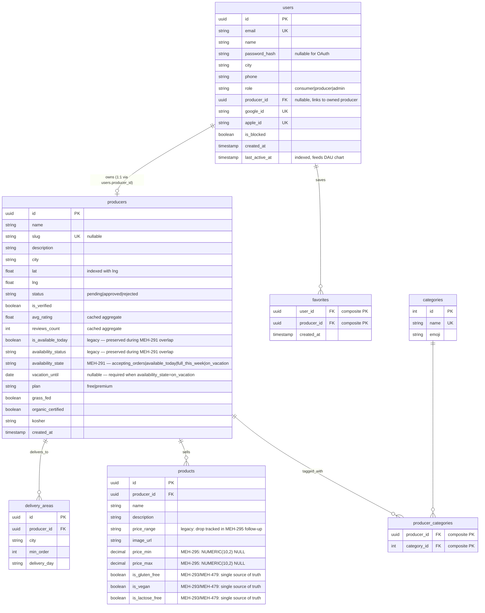
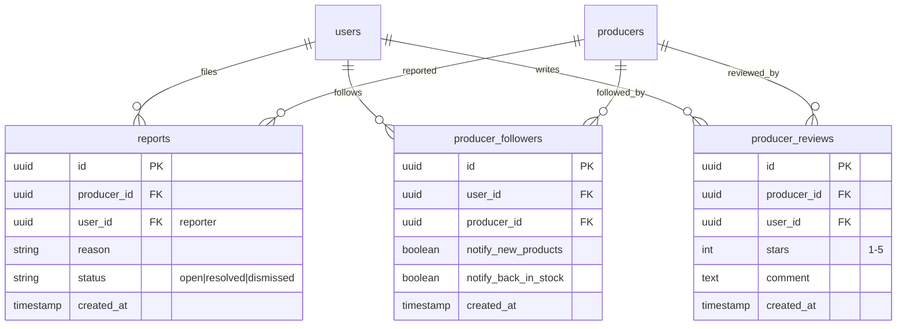
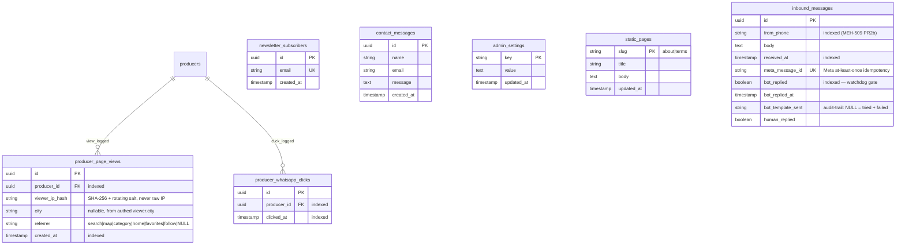

# מהמקור — DB schema

> Mermaid ER diagram for the main tables + relationships. **Source of
> truth is `backend/app/models/models.py`** — if this drifts, update
> the diagram in the same PR (workflow rule 11).
>
> Grouped into four logical clusters to keep the diagram legible:
>   1. Core directory (producers, categories, delivery, users)
>   2. Community content (home products, experiences, events)
>   3. Trust & safety (reviews, reports, moderation, favorites, followers)
>   4. Analytics (views, WhatsApp clicks, DAU) + marketing (newsletter, contact)

## 1. Core directory



## 2. Community content — home products, events, experiences

```mermaid
erDiagram
    users ||--o{ home_products : "lists"
    users ||--o{ events : "hosts (producer)"
    users ||--o{ experiences : "hosts (producer)"
    home_products ||--o{ home_product_whatsapp_clicks : "gets clicks"
    home_product_whatsapp_clicks ||--o| home_product_ratings : "optional 1:1"

    home_products {
        uuid id PK
        uuid user_id FK
        string title
        text description
        string phone
        string city
        string neighborhood
        int quantity
        numeric price
        string category
        string moderation_status "APPROVED|FLAGGED|REJECTED"
        text moderation_reason "Claude Opus output"
        text moderation_suggestion
        boolean is_active
        boolean is_hidden
        date available_until
        timestamp created_at
    }

    home_product_whatsapp_clicks {
        uuid id PK
        uuid user_id FK "viewer"
        uuid home_product_id FK
        timestamp clicked_at
        boolean rating_sent "Twilio follow-up 24h"
        boolean rated
        string rating_token UK
    }

    home_product_ratings {
        uuid id PK
        uuid click_id FK UK "one rating per click"
        uuid user_id FK
        int stars "1-5"
        string comment "max 100 chars"
    }

    events {
        uuid id PK
        uuid producer_id FK
        string title
        text description
        date event_date
        time event_time
        numeric price
        int capacity
        string city
        string status "pending|approved|rejected"
    }

    experiences {
        uuid id PK
        uuid user_id FK "host"
        string title
        text description
        string city
        timestamp starts_at
        int duration_minutes
        numeric price
        int capacity
        string status "pending|changes_requested|approved|rejected"
        text moderation_notes "Claude Haiku pre-check output"
        timestamp created_at
    }
```

## 3. Trust & safety — reviews, reports, followers



## 4. Analytics + marketing



## Locked invariants (do not drift)

- **No PostGIS.** `producers.lat` + `producers.lng` are plain `FLOAT`. Distance queries use Haversine in raw SQL (see `backend/app/routers/producers.py::_haversine_km`). Reverting this breaks Railway deploy.
- **IPs are always hashed.** `producer_page_views.viewer_ip_hash` is SHA-256 of `ip + settings.secret_key[:32]` — never raw IP, per Privacy Law amendment 13 (2025) and `docs/SECURITY.md` §8a.
- **Cached rating aggregates.** `producers.avg_rating` + `producers.reviews_count` are cached from `producer_reviews` to avoid a JOIN on every producer detail request. Update them transactionally when writing/deleting a review.
- **Experience vs Event moderation are different flows.** Events: direct admin approval. Experiences: Claude Haiku pre-check → admin queue → approval. Don't conflate them (see `docs/MODERATION.md`).
