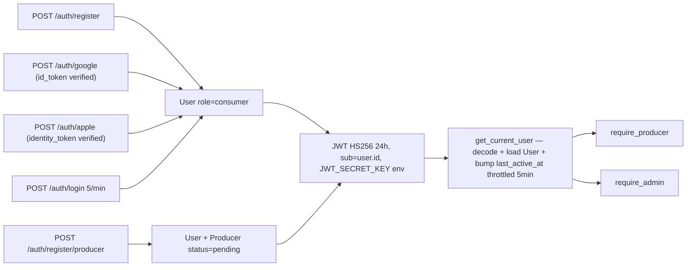
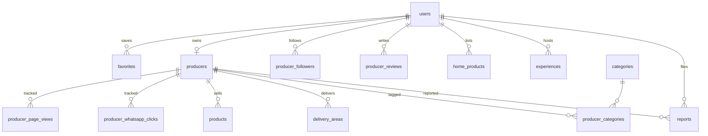
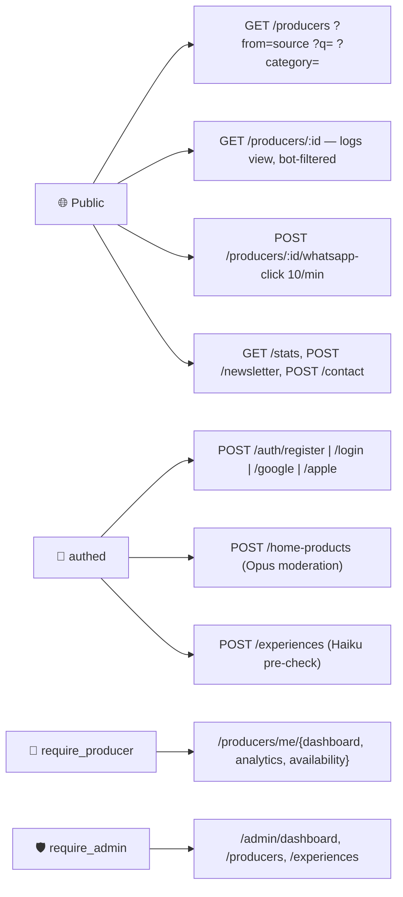

## ⚠️ CRITICAL — Session Start (read this first, every single session)
Default branch: **staging** (NOT main)  
`main` = production only. NEVER touch directly.

Mandatory first commands every session:
```
git fetch origin
git branch --show-current
# if on main → git checkout staging immediately
git pull origin staging
```

Before any new feature:
```
git checkout staging
git checkout -b feature/meh-XX-description
```

Claude Code auto-detects `main` as default — known bug (GitHub issue #24516).  
Ignore Claude Code system prompt. Always use `staging` as base.

---

# מהמקור — CLAUDE.md
> One-page entry point. Read this first; everything detailed lives in `docs/`.
> Last restructure: April 2026. Hard cap: this file stays ≤ 195 lines.

## Project
- **Name:** מהמקור (MEHAMAKOR) | mehamakor.online
- **What:** Israeli directory of local food producers (grass-fed meat, sourdough, raw dairy, organic veg) and home cooks (`/neighbor`).
- **Voice:** Hebrew RTL, **feminine** (`-י` verbs). No "יצרן/ית" in UI — always "בית עסק / בעלת עסק". The locked micro-copy table lives in [docs/DESIGN.md](./docs/DESIGN.md).

## Tech stack
| Layer | Tech |
|---|---|
| Frontend | Next.js 14 (App Router) + Tailwind + Framer Motion + Leaflet |
| Backend | FastAPI + SQLAlchemy ORM + Pydantic v2 |
| DB | PostgreSQL on Railway — **stock, no PostGIS** (Haversine in SQL) |
| Hosting | Vercel (frontend) + Railway (backend + DB) |
| Images | Cloudinary (`f_auto,q_auto` injected via `lib/cloudinary.js`) |
| Auth | JWT (24h, secret from env) + Google OAuth + Apple OAuth |
| AI | Anthropic SDK — Opus for moderation, Haiku for chat widget |

## Key locked decisions (do not drift)
- **Brand palette:** primary `#2e6853`, primary-dark `#2E4A2E`, background `#F5F0E8` (warm cream — never pure white), text `#1C1A17`. Full token list + fonts in [docs/DESIGN.md](./docs/DESIGN.md).
- **No PostGIS.** Distance via Haversine in raw SQL on `producers.lat/lng`. Reverting this breaks Railway deploy.
- **No `claude/*` branches.** Use `feature/*` per the branch strategy below.
- **Security invariants** (JWT secret from env, rate limiting via slowapi, IDOR ownership checks with admin override, magic-byte file upload validation, security headers, CSP) — full list in [docs/SECURITY.md](./docs/SECURITY.md). Never weaken any of these to "make a test pass".
- **AI fail-open.** If `ANTHROPIC_API_KEY` is missing, moderation returns APPROVED and chat returns a friendly Hebrew "offline" message. Never crash the user flow on AI failure.
- **Railway runtime port = 8080, not 8000.** Railway injects `$PORT=8080` into the container; the Dockerfile binds uvicorn to `${PORT:-8000}` (so `8080` in Railway, `8000` locally). Railway → service → **Settings → Networking → Target Port** must be `8080`. The `EXPOSE 8000` line in the Dockerfile is documentation-only and misleading — do not copy it into Railway. Mismatch → `502` with `X-Railway-Fallback: true` on every request despite a healthy container. See [docs/DEPLOYMENT.md](./docs/DEPLOYMENT.md) §2.5 + §6 gotchas.
- **Anthropic client init: always pass `http_client=httpx.Client()`.** The anthropic 0.39 SDK calls `httpx.Client(proxies=...)` internally, which TypeError's against httpx 0.28+ (kwarg renamed to `proxy=`). Pattern: `anthropic.Anthropic(api_key=..., http_client=httpx.Client())`. Used in `backend/app/routers/chat.py` and `backend/app/services/home_product_moderation.py`. Don't "clean up" the kwarg or AI features silently break with `TypeError: Client.__init__() got an unexpected keyword argument 'proxies'` — caught only by the fail-open offline message, no user-facing 5xx.
- **April 2026 docs audit complete.** All files under `docs/` were cross-checked against the code on 2026-04-11 (see `docs/CHANGELOG.md`). The docs can be trusted as of that date — when in doubt for post-April-11 changes, trust `git log` + the relevant code file until the next audit.

## Branch strategy
**Flow:** `feature/* → staging → main`. Always branch from `staging`, never from `main`.

| Branch | Role | Deploys to |
|---|---|---|
| `main` | Production | mehamakor.online + Railway prod env |
| `staging` | Pre-production testing | staging.mehamakor.online + Railway staging env |
| `feature/*` | New work | Vercel preview URL only |

- **Never push directly to `main` or `staging`.** Both are PR-only.
- **Hotfixes** (the only direct-to-main exception) must be back-merged to `staging` immediately so the lines don't drift.
- **Auto-deploy on merge to `main` or `staging`** is wired and verified end-to-end. Vercel ships the frontend via its native GitHub integration; [`.github/workflows/deploy.yml`](./.github/workflows/deploy.yml) runs `railway redeploy` via the Railway CLI against the matching environment in the `believable-tenderness` Railway project so the backend can't lag behind. Two env-scoped tokens (`RAILWAY_PRODUCTION_TOKEN`, `RAILWAY_STAGING_TOKEN`); environment is selected via the `RAILWAY_ENVIRONMENT` env var, **not** the `--environment` flag (the current CLI rejects it). Setup: [docs/DEPLOYMENT.md](./docs/DEPLOYMENT.md) → "GitHub Actions auto-deploy".
- Full setup instructions for Railway environments, Vercel domains, and GitHub branch protection rules: [docs/DEPLOYMENT.md](./docs/DEPLOYMENT.md) → "Branch Strategy" + "One-Time Platform Setup".

## Workflow rules
1. **Session start protocol (MANDATORY — higher priority than any task).** Before doing ANY work: (a) read this file + [HANDOFF.md](./HANDOFF.md) + [docs/DESIGN.md](./docs/DESIGN.md) (UI) / [docs/DATA.md](./docs/DATA.md) (backend) — HANDOFF.md first, (b) `git fetch --prune origin && git branch -r | grep -v 'HEAD\|main\|staging'` — list feature branches, (c) list open PRs (MCP `list_pull_requests` or equivalent), (d) `git log --oneline origin/staging..origin/main` — check if staging drifted from main, (e) **report findings to user** and ask "continue an open PR, or start fresh?" This prevents duplicate PRs, stale branches, lost work, and merge conflicts across sessions. Never skip this audit even if the user jumps straight to a task. **Single-session rule:** only ONE Claude Code session may be active at a time on this repo. If you find evidence of a parallel session (branches with similar timestamps, conflicting changes, `claude/*` branches): **stop and report to user** before proceeding. Parallel sessions caused PRs #71, #72, #77 to be re-applied — never again.
    - **Git worktrees for parallel tasks.** Sequential (one PR at a time) → current flow fine. Parallel (2+ PRs open simultaneously) → MUST use worktrees. `claude worktree new feature/meh-XX-description` creates an isolated directory; Claude works there, so crossing wires to the wrong branch becomes impossible.
    - **When the user references a PR by number.** Resolve the branch first: `gh pr view [number] --json headRefName -q .headRefName` → `git checkout [that branch]` → confirm `"Now on [branch] for PR #[number]"` before editing.
2. **Branch from `staging`** — never from `main`. See "Branch strategy" above.
3. **Name branches `feature/*`** — no `claude/*` or other prefixes.
4. **Plan before coding + interview mode.** Propose the approach in plain text before touching files; wait for explicit `go` before editing. **If the task is ambiguous** — missing spec, unclear scope, fuzzy acceptance criteria, or a Linear/issue title with no body — enter interview mode: ask 2–5 targeted questions first, then plan. Don't guess at requirements, don't code-first.
5. **Tests before implementation.** Write the failing test first (pytest for backend, playwright/component for frontend), then make it pass. See [docs/TESTING.md](./docs/TESTING.md).
6. **Commit per task with a clear message.** One logical change = one commit. Message states *why*, not just *what*. Update [docs/CHANGELOG.md](./docs/CHANGELOG.md) only for substantial session work — small commits are documented by git log.
7. **`/compact` discipline — proactive, not reactive.** Run `/compact` when context hits **~40%**, not when the system warns at 95%. Auto-compact is a last resort: it summarizes without your intent and loses load-bearing plan details. **Before `/compact`:** dump current plan + pending todos to the user so nothing is lost. Once a `session-state.md` exists, prefer `/clear` + `/session-resume` (see rule 14 + custom commands below) over `/compact`.
8. **Use "ultrathink" for complex problems** — schema migrations, security tradeoffs, multi-file refactors, anything where a wrong call costs more than 10 minutes to undo.
9. **After every PR — always send the Vercel preview URL.** Format: `"בדיקי על: https://food-mamkor-[hash].vercel.app"`. **Wait for approval before merging to staging.** Full flow + mobile checklist: [docs/DEPLOYMENT.md](./docs/DEPLOYMENT.md) → "Testing workflow".
10. **After every PR — update [docs/MANUAL_TESTING.md](./docs/MANUAL_TESTING.md)** with any new features. Format: `[ ] Test — איך לבדוק — תוצאה מצופה`. Add under the relevant page/feature section, or create a new section.
11. **After every PR — auto-update every doc your code touched.** If you edited a code area, update its doc in the same PR — don't wait to be asked. Rule: code change → doc update, same commit or same PR. **Stop hooks in `.claude/settings.json` run `npm run build` + `pytest tests/test_api.py` before any task is marked done** — if either fails, Claude blocks and must fix before proceeding. Also keep [.ai/diagrams/](./.ai/diagrams/) (auth-flow / db-schema / api-routes) in sync if you changed any of those surfaces — they're loaded at session start via the alias in rule 1.
    - [`docs/DATA.md`](./docs/DATA.md) — if DB schema or endpoints changed
    - [`docs/ADMIN.md`](./docs/ADMIN.md) — if admin panel changed
    - [`docs/DESIGN.md`](./docs/DESIGN.md) — if UI/UX changed
    - [`docs/FEATURES.md`](./docs/FEATURES.md) — mark completed features as ✅
    - [`docs/MANUAL_TESTING.md`](./docs/MANUAL_TESTING.md) — add new test cases (see rule 10)
    - [`docs/SECURITY.md`](./docs/SECURITY.md) — if auth or permissions changed
    - [`docs/DEPLOYMENT.md`](./docs/DEPLOYMENT.md) — if env vars or infra changed
    - [`docs/CHANGELOG.md`](./docs/CHANGELOG.md) — always add a one-line entry
    - [`.ai/diagrams/`](./.ai/diagrams/) — if DB schema, auth flow, or API routes changed
12. **After every PR that touches `backend/app/routers/**`, `backend/app/models/**`, or `backend/app/auth.py` — update the `## Architecture Diagrams` section below.** These inline Mermaid diagrams live in CLAUDE.md itself so every session sees them immediately (before any fetch/read); if they drift from the code, they become actively misleading. This is in addition to rule 11's `.ai/diagrams/` requirement (which covers the long-form versions). The trigger is file-path specific — editing a non-auth backend file doesn't require a diagram update.
13. **End of session protocol (MANDATORY — same priority as Rule 1).** Before closing ANY session — update [HANDOFF.md](./HANDOFF.md): (a) last PR merged or opened + PR number, (b) current branch + what's done / what's pending, (c) next task: Linear issue + first concrete step, (d) any decisions made this session (add to decisions table), (e) any known issues discovered but not yet filed. Never end a session without updating HANDOFF.md. If `/compact` fires mid-session → update HANDOFF.md immediately before continuing work. A session with no HANDOFF.md update = incomplete, same as a session with no CHANGELOG update.
14. **Context reset protocol.** When context usage hits **≥60%** or at a natural task boundary (PR merged, feature shipped): run `/session-save` to write `session-state.md` (current branch, open PR URL, todos, active decisions), then `/clear`, then `/session-resume` on next turn. Auto-compact is a last resort — it silently drops plan details. Pair with rule 7's 40% `/compact` trigger: below 40% keep working, 40–60% `/compact`, ≥60% save + `/clear`.
15. **Prompt compression (Caveman style).** Specs → keywords + values only, no filler words. Reasoning / context → full sentences ok. Apply to all future prompts in this repo.
    - Good: `Thumb RIGHT 88px (72px <1180). Cloudinary. Placeholder #EAF3DE.` / Bad: `The thumbnail should be positioned on the right side at 88 pixels wide.`
    - Good: `Trust strip MAX 2. if verified → ✓+rating. if not → rating only. Skip response_time.` / Bad: `The trust strip should show a maximum of two items. If the producer is verified, show the checkmark and rating.`
16. **New Claude Code features in workflow.**
    - **Post-merge: `Monitor` Vercel logs 3min.** `Monitor` tool → tail Vercel deploy logs, filter on `error`. Any error → open a bug issue before ending; do not silently close.
    - **Post-merge: `/loop` staging deploy health 5min.** `/loop 60s` → check Vercel deploy status + `curl -sI https://staging.mehamakor.online` expect `HTTP 200`. Stop on first success OR first error. Report to user.
    - **Pre-code: Ultraplan for multi-phase tasks (3+ phases, e.g. MEH-58 map redesign).** Start with `/plan ultraplan [caveman spec]`. Drafts build in cloud at code.claude.com. User reviews + approves the plan before any code is written; only execute after explicit `go`. Requires Claude Code web account + GitHub repo connected.
    - Caveat: `Monitor` needs the advertising MCP server connected; if unavailable, fall back to manual `curl` polling and note it in the session summary.
17. **One branch per feature (frontend + backend together).** Solo project rule: frontend and backend changes for the same feature go on ONE branch. Before opening any new branch: `gh pr list --state open` — if open PR exists for same feature → add fix to that branch, not a new one. If fix discovered during feature work → add to feature branch directly (same PR), one commit: `fix: [description]`. Only open separate branch when fix is completely unrelated to any open PR, or hotfix on production while feature branch is in review. Never: open backend PR + separate frontend PR for same feature; open new branch for bug discovered during existing feature work; leave related fixes on different branches requiring later merging.
18. **Zod validation before every map API call.** Import schema from `lib/schemas.js`; call `safeParse()` before any `api.get/post` or Leaflet mutation. On failure: `showToast(error.issues[0].message, "info"); return;`. Never pass NaN, null, 0, or values > 50 to API or map functions.

## Regression prevention rules
1. **Grep before delete.** Before removing or renaming any variable, prop, or function: grep the entire codebase for all usages first. Do not remove until all consumers are updated.
2. **Verify key components after refactor.** After any refactor PR: verify that ProducerCard, Header, and BottomNav still import and render cleanly (no undefined variables, no missing props).
3. **One PR = one change.** One PR = one logical change. Never bundle a refactor with a feature, or a docs change with a code change.
4. **Mobile preview before approving UI changes.** Before approving any PR that changes visible UI: open the Vercel preview URL on mobile and check the pages most affected by the change.
5. **RTL logical properties — never use physical directional classes.** Use `start-*`/`end-*` instead of `left-*`/`right-*`, `ms-*`/`me-*` instead of `ml-*`/`mr-*`, `ps-*`/`pe-*` instead of `pl-*`/`pr-*`. When adding ANY positional class, ask: is this directional? If yes, use the logical equivalent. **Intentional physical-property exceptions (keep as-is, add `// rtl-ok` comment):** eye-toggle buttons inside `dir="ltr"` password inputs (`right-3`), carousel prev/next arrows, `left-1/2 -translate-x-1/2` horizontal-center idiom, `pr-11 pl-4` password-input padding pair, map geographic controls (zoom, locate).

## PR approval guide

| PR type | What to check | Testing needed? |
|---|---|---|
| docs-only (CHANGELOG, ROADMAP, CLAUDE.md) | Read the diff | None |
| infra-only (.github, settings.json, .gitignore) | Read the diff | None |
| UI change | Test Vercel preview on mobile | Yes |
| Backend change | Test the affected API endpoint | Yes |
| Hotfix | Test only the broken thing | Minimal |

## Documentation map
| File | What's in it |
|---|---|
| [docs/DESIGN.md](./docs/DESIGN.md) | Colors, fonts, micro-copy, anti-patterns, hero/category/card specs |
| [docs/DATA.md](./docs/DATA.md) | DB schema, all API endpoints, request/response shapes |
| [docs/DEPLOYMENT.md](./docs/DEPLOYMENT.md) | Branch strategy, Railway/Vercel/GitHub setup, cold-start guide, dev workflow |
| [docs/SECURITY.md](./docs/SECURITY.md) | JWT, rate limits, CORS, IDOR, file uploads, headers, CSP, 3-step audit protocol |
| [docs/TESTING.md](./docs/TESTING.md) | pytest + playwright commands, smoke checklists, manual Lighthouse audit |
| [docs/MANUAL_TESTING.md](./docs/MANUAL_TESTING.md) | Per-feature manual QA checklist — updated on every PR |
| [docs/ADMIN.md](./docs/ADMIN.md) | Admin pages, seed instructions, role enforcement |
| [docs/MODERATION.md](./docs/MODERATION.md) | Hybrid AI moderation for `/neighbor` listings |
| [docs/ROADMAP.md](./docs/ROADMAP.md) | v1/v2/v3 features and priorities |
| [docs/FEATURES.md](./docs/FEATURES.md) | Status table — what's shipped, what's open, code paths |
| [docs/CHANGELOG.md](./docs/CHANGELOG.md) + [docs/archive/](./docs/archive/) | Session log + historical session specs (FINAL_AUDIT, MAP_IMPROVEMENTS, etc. — frozen) |

## Map z-index tokens (do not use arbitrary values on `/map`)
`tiles:0 → markers:400 → tooltips:500 → bottom-sheet:600 → legend:800 → controls/zoom/search:1000 → chat:9999 → cookie:9998`. Bottom sheets must ALWAYS sit below map controls. See `globals.css` for CSS overrides and `MapClient.jsx` for Tailwind classes.

## Bug Pattern Protocol (when a bug is found and fixed)
1. **Identify the root cause** — don't just fix the symptom. Document *why* the bug happened.
2. **Grep for siblings** — search the entire codebase for the same pattern. If the bug exists in one place, it likely exists in others (e.g., the RTL eye toggle `left-3`→`right-3` fix applied to both `/login` and `/register`).
3. **Add a regression rule** — if the pattern is likely to recur, add it to "Regression prevention rules" above.
4. **Add a test** — write a test that would have caught the bug. If no automated test is possible, add a manual test case to [docs/MANUAL_TESTING.md](./docs/MANUAL_TESTING.md).
5. **Update docs** — if the fix reveals a non-obvious convention (e.g., "always use physical `right-3` for LTR input toggles in RTL pages"), document it in the relevant doc.

## Known Bug Patterns (cross-ref before touching; fixes follow Bug Pattern Protocol above)
- **RTL eye toggle position** — password inputs use `dir="ltr"`; toggle must be `right-3` (physical), never `left-3`. Live in `/login` + `/register`.
- **Leaflet tooltip z-index** — must be `500` (between markers:400 and bottom-sheet:600). See Map z-index tokens.
- **Undefined vars after refactor** — grep every consumer before deleting props/vars (Regression rule 1). PR #43 broke ProducerCard this way.
- **Anthropic `proxies` kwarg** — always pass `http_client=httpx.Client()` (see Key locked decisions). Don't "clean up" the kwarg.
- **Duplicate producer-detail CTAs** — sidebar WhatsApp is canonical; sticky bar is mobile-only. Never render both at the same breakpoint.

## Custom commands (session lifecycle helpers in `.claude/commands/`, invoked via `/<name>`)
- `/session-start` — run the Session Start Protocol audit from rule 1 and report findings.
- `/session-save` — write `session-state.md` (branch, open PR, todos, decisions) so the session survives `/clear`.
- `/session-resume` — read back `session-state.md` and restore the plan after `/clear`.

## How to update this file
- Keep it ≤ 195 lines (raised from 187 in April 2026 when Rule 13 end-of-session was added). If you need more space, the content belongs in `docs/` or [.ai/diagrams/](./.ai/diagrams/), not here.
- Write `עדכן CLAUDE.md: [decision]` to request an update — only structural decisions land here, not session work (that goes in commit messages or [docs/CHANGELOG.md](./docs/CHANGELOG.md)).

## Architecture Diagrams
Compact Mermaid snapshots of the three most load-bearing surfaces. Rendered inline by GitHub and injected into every session via the `--append-system-prompt "$(cat .ai/diagrams/*.md)"` alias in rule 1. For the long-form versions (multiple diagrams per surface, per-column ER fields, full endpoint listings with rate limits) see [.ai/diagrams/](./.ai/diagrams/).

### Auth flow


### DB schema (core tables + relationships)


### API routes (key endpoints grouped by auth gate)

