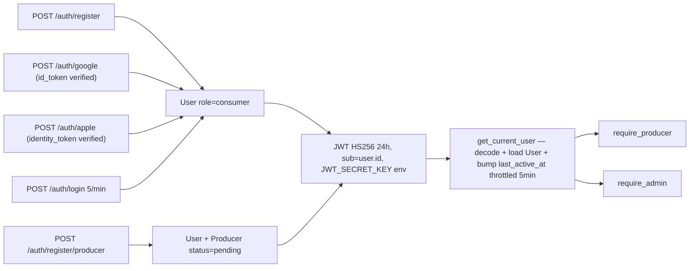
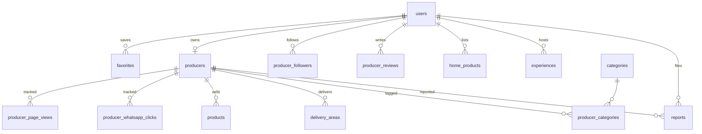
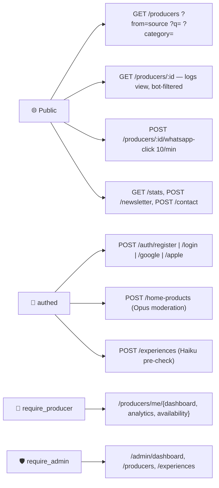

# מהמקור — CLAUDE.md
> One-page entry point. Read this first; everything detailed lives in `docs/`.
> Last restructure: April 2026. Hard cap: this file stays ≤ 100 lines.

## Project
- **Name:** מהמקור (MEHAMAKOR) | mehamakor.online
- **What:** Israeli directory of local food producers (grass-fed meat, sourdough, raw dairy, organic veg) and home cooks (`/neighbor`).
- **Voice:** Hebrew RTL, **feminine** (`-י` verbs). No "יצרן/ית" in UI — always "בית עסק / בעלת עסק". The locked micro-copy table lives in [docs/DESIGN.md](./docs/DESIGN.md).

## Tech stack
| Layer | Tech |
|---|---|
| Frontend | Next.js 14 (App Router) + Tailwind + Framer Motion + Leaflet |
| Backend | FastAPI + SQLAlchemy ORM + Pydantic v2 |
| DB | PostgreSQL on Railway — **stock, no PostGIS** (Haversine in SQL) |
| Hosting | Vercel (frontend) + Railway (backend + DB) |
| Images | Cloudinary (`f_auto,q_auto` injected via `lib/cloudinary.js`) |
| Auth | JWT (24h, secret from env) + Google OAuth + Apple OAuth |
| AI | Anthropic SDK — Opus for moderation, Haiku for chat widget |

## Key locked decisions (do not drift)
- **Brand palette:** primary `#2e6853`, primary-dark `#2E4A2E`, background `#F5F0E8` (warm cream — never pure white), text `#1C1A17`. Full token list + fonts in [docs/DESIGN.md](./docs/DESIGN.md).
- **No PostGIS.** Distance via Haversine in raw SQL on `producers.lat/lng`. Reverting this breaks Railway deploy.
- **No `claude/*` branches.** Use `feature/*` per the branch strategy below.
- **Security invariants** (JWT secret from env, rate limiting via slowapi, IDOR ownership checks with admin override, magic-byte file upload validation, security headers, CSP) — full list in [docs/SECURITY.md](./docs/SECURITY.md). Never weaken any of these to "make a test pass".
- **AI fail-open.** If `ANTHROPIC_API_KEY` is missing, moderation returns APPROVED and chat returns a friendly Hebrew "offline" message. Never crash the user flow on AI failure.
- **Railway runtime port = 8080, not 8000.** Railway injects `$PORT=8080` into the container; the Dockerfile binds uvicorn to `${PORT:-8000}` (so `8080` in Railway, `8000` locally). Railway → service → **Settings → Networking → Target Port** must be `8080`. The `EXPOSE 8000` line in the Dockerfile is documentation-only and misleading — do not copy it into Railway. Mismatch → `502` with `X-Railway-Fallback: true` on every request despite a healthy container. See [docs/DEPLOYMENT.md](./docs/DEPLOYMENT.md) §2.5 + §6 gotchas.
- **Anthropic client init: always pass `http_client=httpx.Client()`.** The anthropic 0.39 SDK calls `httpx.Client(proxies=...)` internally, which TypeError's against httpx 0.28+ (kwarg renamed to `proxy=`). Pattern: `anthropic.Anthropic(api_key=..., http_client=httpx.Client())`. Used in `backend/app/routers/chat.py` and `backend/app/services/home_product_moderation.py`. Don't "clean up" the kwarg or AI features silently break with `TypeError: Client.__init__() got an unexpected keyword argument 'proxies'` — caught only by the fail-open offline message, no user-facing 5xx.
- **April 2026 docs audit complete.** All files under `docs/` were cross-checked against the code on 2026-04-11 (see `docs/CHANGELOG.md`). The docs can be trusted as of that date — when in doubt for post-April-11 changes, trust `git log` + the relevant code file until the next audit.

## Branch strategy
**Flow:** `feature/* → staging → main`. Always branch from `staging`, never from `main`.

| Branch | Role | Deploys to |
|---|---|---|
| `main` | Production | mehamakor.online + Railway prod env |
| `staging` | Pre-production testing | staging.mehamakor.online + Railway staging env |
| `feature/*` | New work | Vercel preview URL only |

- **Never push directly to `main` or `staging`.** Both are PR-only.
- **Hotfixes** (the only direct-to-main exception) must be back-merged to `staging` immediately so the lines don't drift.
- **Auto-deploy on merge to `main` or `staging`** is wired and verified end-to-end. Vercel ships the frontend via its native GitHub integration; [`.github/workflows/deploy.yml`](./.github/workflows/deploy.yml) runs `railway redeploy` via the Railway CLI against the matching environment in the `believable-tenderness` Railway project so the backend can't lag behind. Two env-scoped tokens (`RAILWAY_PRODUCTION_TOKEN`, `RAILWAY_STAGING_TOKEN`); environment is selected via the `RAILWAY_ENVIRONMENT` env var, **not** the `--environment` flag (the current CLI rejects it). Setup: [docs/DEPLOYMENT.md](./docs/DEPLOYMENT.md) → "GitHub Actions auto-deploy".
- Full setup instructions for Railway environments, Vercel domains, and GitHub branch protection rules: [docs/DEPLOYMENT.md](./docs/DEPLOYMENT.md) → "Branch Strategy" + "One-Time Platform Setup".

## Workflow rules
1. **Read CLAUDE.md first** at the start of every session. Also read [docs/DESIGN.md](./docs/DESIGN.md) before touching UI and [docs/DATA.md](./docs/DATA.md) before backend changes (a pre-commit hook in `.claude/settings.json` reminds you on `frontend/` or `backend/` edits). **Optional but recommended:** preload architecture context at session start with `claude --append-system-prompt "$(cat .ai/diagrams/*.md)"` — injects the auth/DB/API Mermaid diagrams from [.ai/diagrams/](./.ai/diagrams/) so the session starts with full mental model, no re-reads needed.
2. **Branch from `staging`** — never from `main`. See "Branch strategy" above.
3. **Name branches `feature/*`** — no `claude/*` or other prefixes.
4. **Plan before coding.** Propose the approach in plain text before touching files. Wait for explicit `go` before editing. No code-first.
5. **Tests before implementation.** Write the failing test first (pytest for backend, playwright/component for frontend), then make it pass. See [docs/TESTING.md](./docs/TESTING.md).
6. **Commit per task with a clear message.** One logical change = one commit. Message states *why*, not just *what*. Update [docs/CHANGELOG.md](./docs/CHANGELOG.md) only for substantial session work — small commits are documented by git log.
7. **Use `/compact` every 20–30 messages** to reclaim context budget without losing the plan.
8. **Use "ultrathink" for complex problems** — schema migrations, security tradeoffs, multi-file refactors, anything where a wrong call costs more than 10 minutes to undo.
9. **After every PR — always send the Vercel preview URL.** Format: `"בדיקי על: https://food-mamkor-[hash].vercel.app"`. **Wait for approval before merging to staging.** Full flow + mobile checklist: [docs/DEPLOYMENT.md](./docs/DEPLOYMENT.md) → "Testing workflow".
10. **After every PR — update [docs/MANUAL_TESTING.md](./docs/MANUAL_TESTING.md)** with any new features. Format: `[ ] Test — איך לבדוק — תוצאה מצופה`. Add under the relevant page/feature section, or create a new section.
11. **After every PR — auto-update every doc your code touched.** If you edited a code area, update its doc in the same PR — don't wait to be asked. Rule: code change → doc update, same commit or same PR. **Stop hooks in `.claude/settings.json` run `npm run build` + `pytest tests/test_api.py` before any task is marked done** — if either fails, Claude blocks and must fix before proceeding. Also keep [.ai/diagrams/](./.ai/diagrams/) (auth-flow / db-schema / api-routes) in sync if you changed any of those surfaces — they're loaded at session start via the alias in rule 1.
    - [`docs/DATA.md`](./docs/DATA.md) — if DB schema or endpoints changed
    - [`docs/ADMIN.md`](./docs/ADMIN.md) — if admin panel changed
    - [`docs/DESIGN.md`](./docs/DESIGN.md) — if UI/UX changed
    - [`docs/FEATURES.md`](./docs/FEATURES.md) — mark completed features as ✅
    - [`docs/MANUAL_TESTING.md`](./docs/MANUAL_TESTING.md) — add new test cases (see rule 10)
    - [`docs/SECURITY.md`](./docs/SECURITY.md) — if auth or permissions changed
    - [`docs/DEPLOYMENT.md`](./docs/DEPLOYMENT.md) — if env vars or infra changed
    - [`docs/CHANGELOG.md`](./docs/CHANGELOG.md) — always add a one-line entry
    - [`.ai/diagrams/`](./.ai/diagrams/) — if DB schema, auth flow, or API routes changed
12. **After every PR that touches `backend/app/routers/**`, `backend/app/models/**`, or `backend/app/auth.py` — update the `## Architecture Diagrams` section below.** These inline Mermaid diagrams live in CLAUDE.md itself so every session sees them immediately (before any fetch/read); if they drift from the code, they become actively misleading. This is in addition to rule 11's `.ai/diagrams/` requirement (which covers the long-form versions). The trigger is file-path specific — editing a non-auth backend file doesn't require a diagram update.

## Documentation map
| File | What's in it |
|---|---|
| [docs/DESIGN.md](./docs/DESIGN.md) | Colors, fonts, micro-copy, anti-patterns, hero/category/card specs |
| [docs/DATA.md](./docs/DATA.md) | DB schema, all API endpoints, request/response shapes |
| [docs/DEPLOYMENT.md](./docs/DEPLOYMENT.md) | Branch strategy, Railway/Vercel/GitHub setup, cold-start guide, dev workflow |
| [docs/SECURITY.md](./docs/SECURITY.md) | JWT, rate limits, CORS, IDOR, file uploads, headers, CSP, 3-step audit protocol |
| [docs/TESTING.md](./docs/TESTING.md) | pytest + playwright commands, smoke checklists, manual Lighthouse audit |
| [docs/MANUAL_TESTING.md](./docs/MANUAL_TESTING.md) | Per-feature manual QA checklist — updated on every PR |
| [docs/ADMIN.md](./docs/ADMIN.md) | Admin pages, seed instructions, role enforcement |
| [docs/MODERATION.md](./docs/MODERATION.md) | Hybrid AI moderation for `/neighbor` listings |
| [docs/ROADMAP.md](./docs/ROADMAP.md) | v1/v2/v3 features and priorities |
| [docs/FEATURES.md](./docs/FEATURES.md) | Status table — what's shipped, what's open, code paths |
| [docs/CHANGELOG.md](./docs/CHANGELOG.md) | Session log preserved from earlier CLAUDE.md revisions |
| [docs/archive/](./docs/archive/) | Implemented session specs (FINAL_AUDIT, MAP_IMPROVEMENTS, PREMIUM_DESIGN, etc.) — historical, do not edit |

## How to update this file
- Keep it ≤ 150 lines (raised from 100 in April 2026 when the inline `## Architecture Diagrams` section was added). If you need more space, the content belongs in `docs/` or [.ai/diagrams/](./.ai/diagrams/), not here.
- Write `עדכן CLAUDE.md: [decision]` to request an update — only structural decisions land here, not session work (that goes in commit messages or [docs/CHANGELOG.md](./docs/CHANGELOG.md)).

## Architecture Diagrams
Compact Mermaid snapshots of the three most load-bearing surfaces. Rendered inline by GitHub and injected into every session via the `--append-system-prompt "$(cat .ai/diagrams/*.md)"` alias in rule 1. For the long-form versions (multiple diagrams per surface, per-column ER fields, full endpoint listings with rate limits) see [.ai/diagrams/](./.ai/diagrams/).

### Auth flow

### DB schema (core tables + relationships)

### API routes (key endpoints grouped by auth gate)

